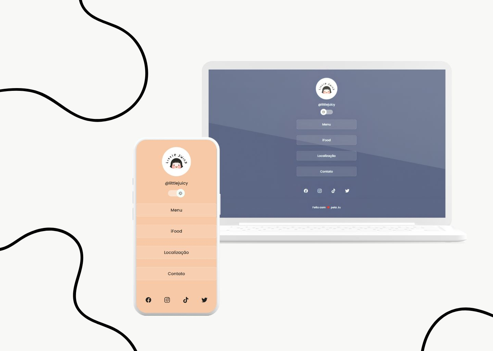

<h1 align="center">Cardify</h1>

  Projeto de cartão de visita online oferecido pela Rocketseat.

  <a href="#overview">Visão Geral</a> •
  <a href="#styling">Estilo</a> •
  <a href="#dark-mode-switcher">Interruptor de Modo Escuro</a> •
  <a href="#acknowledgements">Agradecimentos</a>

 

  

## Visão Geral

Cardify oferece uma interface visualmente atraente e amigável ao usuário, implementada usando HTML, CSS e JavaScript. Recursos principais incluem uma seção de perfil elegante, um menu de navegação, links para redes sociais e um interruptor de modo escuro.

## Estilo

A estilização do projeto está definida no arquivo `style.css`, criando uma aparência coesa e moderna. A paleta de cores inclui fundos em tons de menta, texto branco e efeitos sutis de contorno. O modo escuro introduz fundos em tons mais quentes com cores de contorno ajustadas.

## Interruptor de Modo Escuro

O Cardify inclui um interruptor de modo escuro para oferecer uma experiência visual adaptável às preferências dos usuários. O interruptor está localizado no canto superior do cartão, permitindo uma transição suave entre os modos claro e escuro.

## Agradecimentos

- Biblioteca Ionicons: [Ionicons](https://ionicons.com/)